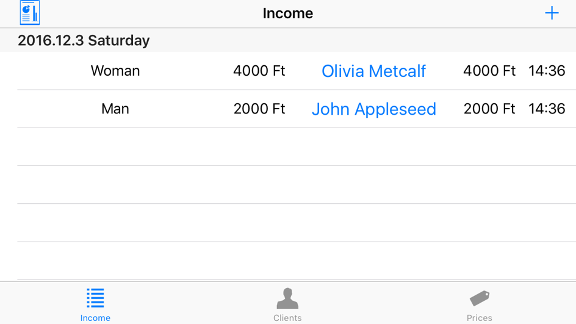
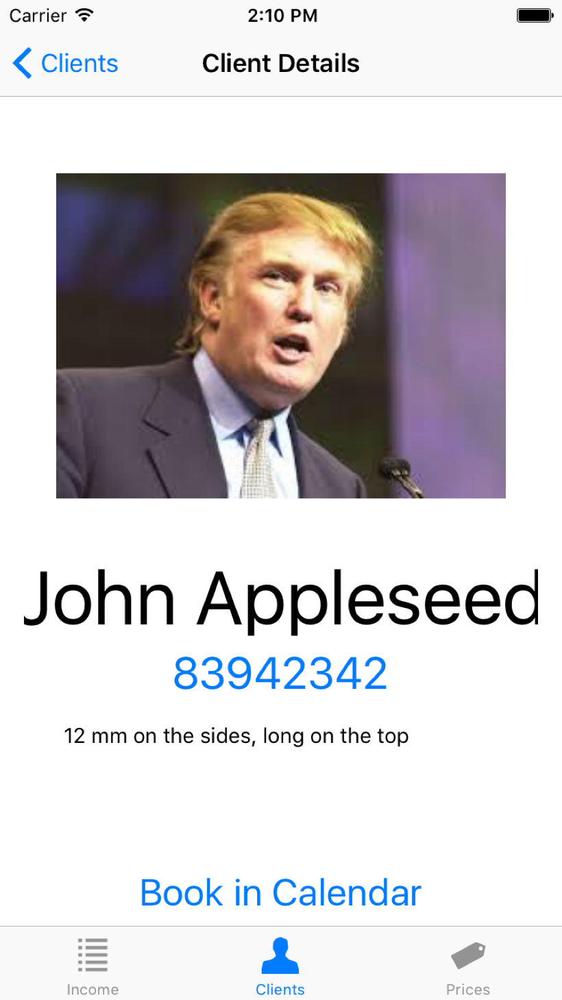
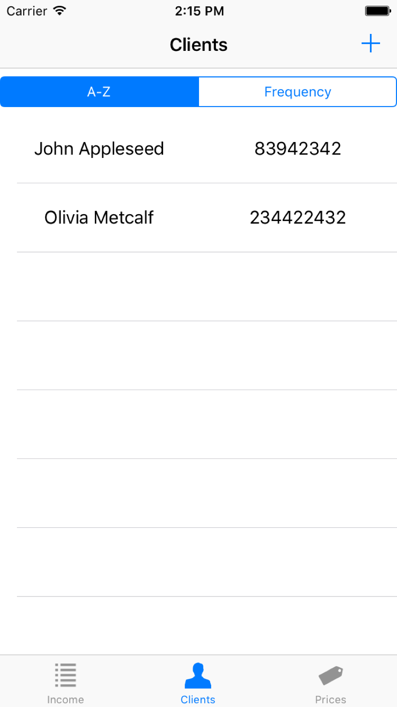
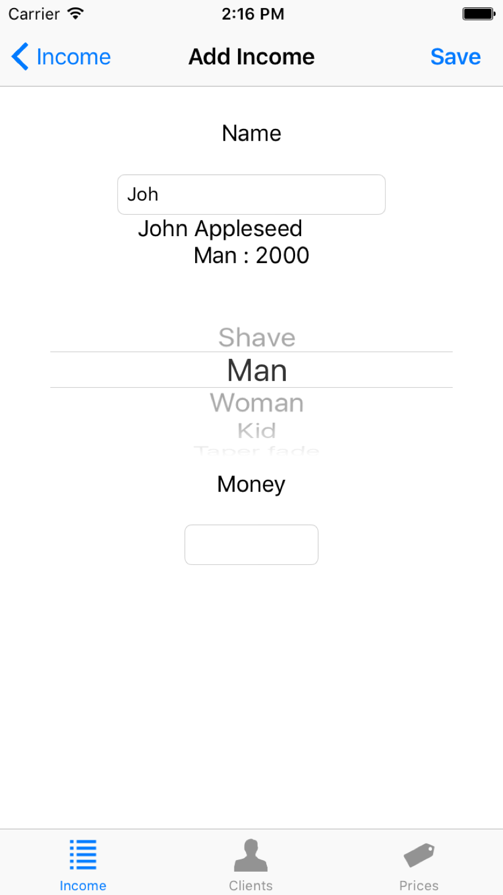

# iBarber

## Specifikáció
Az alkalmazás egy barber (borbély, fodrász) napi tevékenységének rögzítésére alkalmas felületet biztosít, a felhasználó számára konfigurálható módon. A felhasználó rögzíteni tudja, kik jöttek aznap hozzá, és mennyi a bevétele tőlük. Az ügyfelek adatai rögzíthetőek, hogy később könnyebben rögzíteni lehessen őket. 
A vendégek adatai **perzisztens módon** vannak tárolva egy adatbázisban. Az elrendezés **adaptív** , univerzális alkalmazás! A fodrász képes aznapi forgalmát emailben elküldeni, valamint vendég adatait szerkeszteni, újakat felvenni és időpontot adni nekik az IOS beépített naptárában. **Kép készítésére** is lehetőségünk van, hogy gyorsan rögzíteni tudjuk a munkánkat. 

## Beadás

### Leírás
Az iBarber segítségével könnyedén karban tudjuk tartani forgalmunkat. Lehetőségünk van ügyfeleket felvenni névvel, képpel, telefonszámmal és rövid leírással. Majd a bevétel felvételénél automatikus kiegészítéssel (!) rögzíteni tudjuk, mennyit fizetett. A kliensek alkalmazásból felhívhatók, valamint foglalható nekik időpont naptáraink egyikében. Csak válasszuk ki az időintervallumot és a műveletet, és az esemény részleteinek kitöltését bízzuk az alkalmazásra. Az árlista természetesen teljes mértékben testre szabható és kiegészíthető. Aznapi forgalmunkról emailt küldhetünk magunknak a lényeges adatokkal. A forgalom napi szinten van rendszerezve. Ügyfeleink listanézetét szintén többféle attribútum szerint tudjuk rendezni. Az alkalmazás tehát minden olyan barbernek ajánlott, aki munkáját precízen és eredményesen szeretné végezni.

### Opcionális: futtatási segédlet
A + jelre kattintva mindenhol hozzá tud adni adatbázisához elemeket, további tudnivalóra nincs szükség.

### Screenshotok

